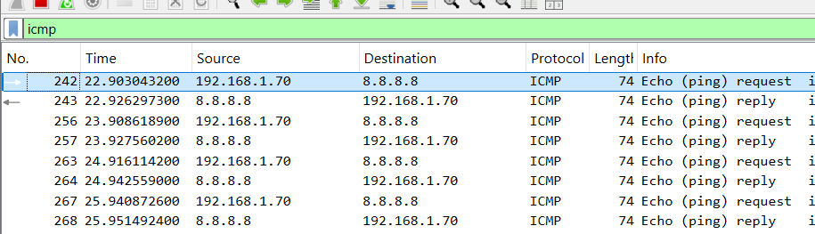
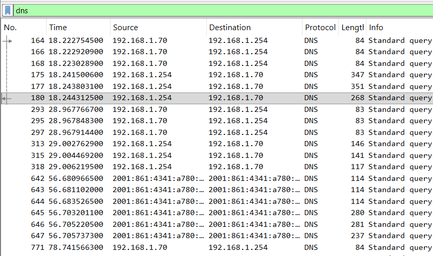
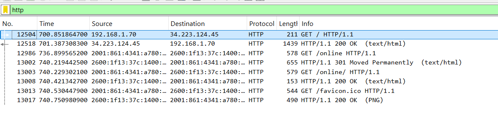

# Mini-lab réseau : analyse ICMP, DNS et HTTP avec Wireshark

## Objectif

Ce projet a pour objectif de comprendre les bases de l’analyse réseau avec Wireshark en observant trois types de trafic :

- ICMP avec la commande ping ;
- DNS avec nslookup ;
- HTTP avec curl.

## Environnement

- Windows
- Wireshark
- Npcap
- Interface réseau : Wi-Fi
- PowerShell

## Commandes utilisées

```powershell
ping -4 -n 4 8.8.8.8
nslookup google.com
curl http://neverssl.com
```

## Filtres Wireshark utilisés

```text
icmp
dns
http
tcp.port == 80
```

## Résultats observés

### 1. Analyse ICMP avec ping

Commande utilisée :

```powershell
ping -4 -n 4 8.8.8.8
```

Filtre Wireshark utilisé :

```text
icmp
```

Observation :

J’ai observé des paquets ICMP de type **Echo Request** envoyés depuis ma machine vers `8.8.8.8`, puis des paquets **Echo Reply** retournés par `8.8.8.8`.

Conclusion :

Le protocole **ICMP** permet de tester si une machine distante est joignable sur le réseau.



---

### 2. Analyse DNS avec nslookup

Commande utilisée :

```powershell
nslookup google.com
```

Filtre Wireshark utilisé :

```text
dns
```

Observation :

J’ai observé une requête DNS permettant de résoudre le nom de domaine `google.com` en adresse IP.

Conclusion :

Le **DNS** permet de convertir un nom de domaine lisible par l’humain en adresse IP utilisable par la machine.



---

### 3. Analyse HTTP avec curl

Commande utilisée :

```powershell
curl http://neverssl.com
```

Filtre Wireshark utilisé :

```text
http
```

ou :

```text
tcp.port == 80
```

Observation :

J’ai observé une requête HTTP de type **GET** envoyée vers le site `neverssl.com`.

Conclusion :

Le protocole **HTTP** permet à un client, comme un navigateur ou curl, de demander une page web à un serveur. Contrairement à HTTPS, le trafic HTTP peut être observé plus facilement dans Wireshark.



## Compétences développées

- Installation et utilisation de Wireshark ;
- Capture de trafic réseau local ;
- Analyse de paquets ICMP, DNS et HTTP ;
- Utilisation de filtres Wireshark ;
- Compréhension des notions client, serveur, adresse IP, DNS et port réseau ;
- Documentation technique d’un mini-lab réseau.

## Conclusion

Ce mini-lab m’a permis de comprendre concrètement comment une machine communique sur le réseau.

J’ai appris à générer du trafic avec des commandes simples, à le capturer avec Wireshark, puis à identifier les protocoles utilisés.
